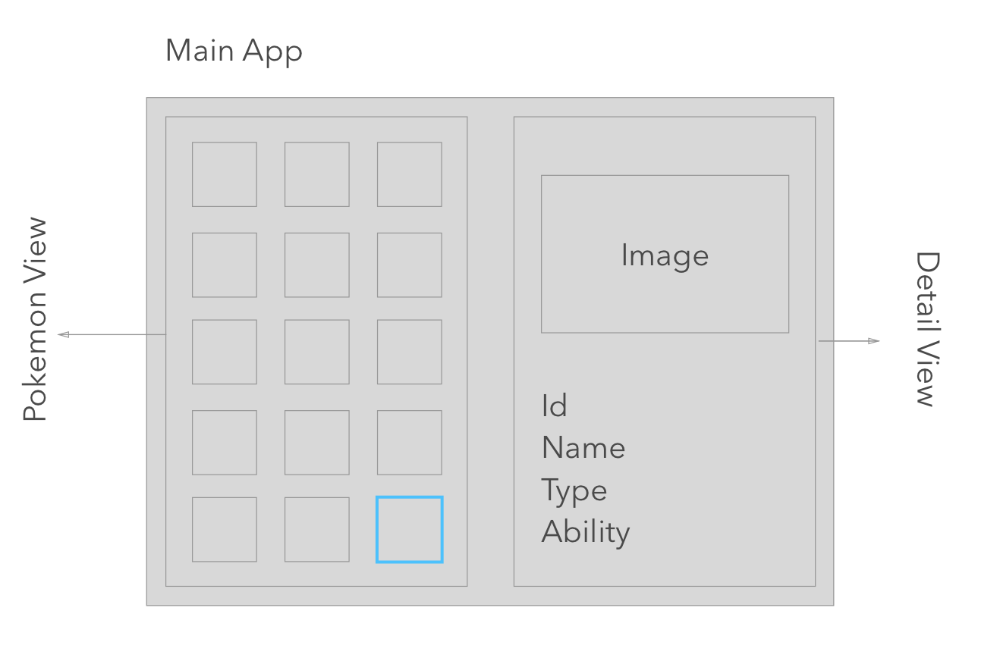
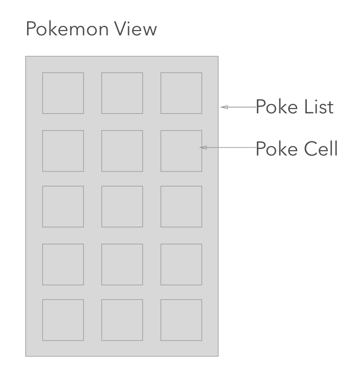

# Lets Build a Pokedex with React 

I love building web apps with React. However, learning how to use the library and getting use to thinking in the React way can be difficult. I believe that personal projects are the best way to learn new things, and thus started to build a Pokedex with React. I had a lot of fun building it and learned a lot, so I decided to make this beginner's workshop for new developers interested in learning how to use React.

We are going to be using the [PokeApi](http://pokeapi.co/) to get all our resources and pokemon data.

* **PART 1** will describe all the file setup
* **PART 2** we will begin making our wireframes and main layout
* **PART 3** we will build the Pokemon view
* **PART 4** we will build the Detail view

Without further ado, lets start coding.

# PART 1

To get the basic project setup you can clone the boilerplate branch of this [repo](https://github.com/jdiejim/pokedex-blog) or continue to follow the basic installation.

## Create React App Installation

You’ll need to have [Node(https://nodejs.org/en/)] >= 6 on your machine in order to install [create-react-app](https://github.com/facebookincubator/create-react-app).

Once Node is installed, proceed to install the create-react-app package globally:

```shell

npm install -g create-react-app

```

## Setting up Create React App Boilerplate

First, create a new pokedex project and move into your new pokedex directory.

```Shell

create-react-app pokedex

```

Inside your pokedex directory you should see a **src** directory that should look like this:

```
src
│   App.css
|   App.js
│   App.test.js
|   index.css
|   index.js
|   logo.svg
|   registerServiceWorker.js

```

This is where we are going to tweak some files to make it more dynamic. Move into **src**, and lets start modifying some files.

```Shell

cd src

```

First remove the logo.svg file since we are no longer going to use it. 

```Shell

rm logo.svg

```

Then create a **test** directory, a **components** directory, and inside the new **components** directory, create a **styles** directory.

```Shell

mkdir test
mkdir components
mkdir components/styles

```

Then move the App files into their corresponding directories

```Shell

mv App.js components/
mv App.css components/styles/
mv App.test.js test/

```

Your new file structure in **src** should look like this:

```
src
|   index.css
|   index.js
|   registerServiceWorker.js
|
|___componets
|   |   App.js
|   |___styles
|       │   App.css
|
|___test
|   |   App.test.js

```

We are almost done. 

Open App.js and replace all the contents with the following code:

```javascript

import React, { Component } from 'react';
import './styles/App.css';

class App extends Component {
  render() {
    return (
      <div className="App">
        Hello World I am a Pokedex
      </div>
    );
  }
}

export default App;

```

Open App.css and delete all the contents inside. We are going to write our own styling so don't worry. 

Finally replace all the contents on your index.js with the following code:

```javascript

import React from 'react';
import ReactDOM from 'react-dom';
import './index.css';
import App from './components/App';
import registerServiceWorker from './registerServiceWorker';

ReactDOM.render(<App />, document.getElementById('root'));
registerServiceWorker();

```

The only change we made here was changing the path of the App component.

We are not going to add anything else to **index.js** in this project. However, is always good to know what is this file doing. This file basically is telling the DOM to render the App component in the element with the id of root found in the html file. App will contain all of our components that we are going to be building.

Ok! We are done with the setup. Lets try it out. To star our application write this command in your terminal:

```shell

npm start

```

This will start our application in the browser in development mode. Now everytime we edit our project you are going to be able to see your changes in the browser. If you have and error, the browser most of the times will show you where the bug is located.

# Part 2

## WireFrame

React is all about building components so we will be making some wireframes that describe each of the components we need to build.

Our main app layout will contain 2 components: the Pokemon view, and the Detail view.

On the pokemon view, the user can navigate through a list of the first generation pokemon. If the user clicks a pokemon, the detail view will display the selected pokemon's details including: name, id, type, sprite, and ability.



### Pokemon View

The pokemon view will contain a scrollable **poke list component** that wraps all the **poke cell components**



### Detail View

The detail view will be only be its own component containing different elements.


## Main Layout

Now that we have our wireframe and our project setup lets begin setting the main app component and styling.

